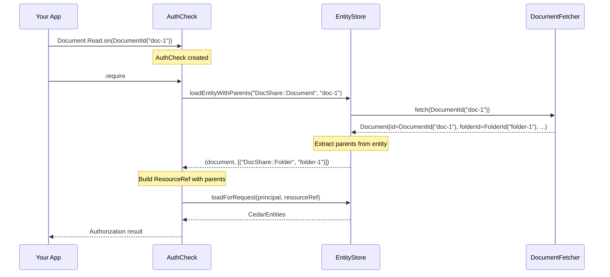

# Entity Resolution with `.on()`

All authorization checks in cedar4s use the `.on(id)` pattern, which loads entities
and resolves parent relationships automatically.

Examples below assume `import myapp.cedar.MyApp.*` is in scope.

## Overview

The `.on(id)` pattern takes a typed entity ID:

```scala
// Check if user can read document - parents loaded automatically
Document.Read.on(DocumentId("doc-1")).require
```

This loads the document from your database, extracts its parent relationships
(e.g., folder), and performs the authorization check with the full entity hierarchy.

## Setup

Authorization checks require `CedarSession` and `FlatMap` in scope:

```scala
given CedarSession[Future] = runtime.session(currentUser)
given FlatMap[Future] = FlatMap.futureInstance

// Authorization checks work
Document.Read.on(DocumentId("doc-1")).require
```

## How It Works



The flow:

1. `.on(id)` creates an `AuthCheck` with the typed entity ID
2. When executed, it calls `EntityStore.loadEntityWithParents(entityType, id)`
3. Your `EntityFetcher.fetch(id)` is called with the typed ID
4. The entity's parents are extracted via `toCedarEntity().parents`
5. A `ResourceRef` is built with entity type, ID, and parent IDs
6. The authorization check executes with the resolved resource

## Entity Parent Extraction

For authorization checks to work, your Cedar entities must define their parent
relationships. cedar4s generates this from your schema:

```cedar
namespace DocShare {
  entity Folder {}
  entity Document in [Folder] {}
}
```

Generated entity includes parent reference with typed IDs:

```scala
case class Document(
  id: DocumentId,
  folderId: FolderId,  // Parent reference
  // ... other attributes
) extends CedarEntity {
  def parents: List[(String, String)] = 
    List(("DocShare::Folder", folderId.value))
}
```

## Usage Patterns

### Basic Check

```scala
// Load document, extract folder parent, check authorization
Document.Read.on(DocumentId("doc-1")).require
```

### With Context

```scala
Document.Read.on(DocumentId("doc-1"))
  .withContext(ReadContext(requestTime = Instant.now()))
  .require
```

### Conditional Check

```scala
Document.Read.on(DocumentId("doc-1"))
  .when(featureEnabled)
  .require
```

### Composition

Checks can be composed, with each entity resolved independently:

```scala
// Both documents loaded separately
val check = 
  Document.Read.on(DocumentId("doc-1")) & 
  Document.Read.on(DocumentId("doc-2"))

check.require
```

## Entity Loading

Each authorization check loads the entity and its parents from your data store. This
ensures Cedar always has the current state of the entity hierarchy.

| Operation | What Happens |
|-----------|--------------|
| `Document.Read.on(id)` | Load document, extract parents |
| `Folder.View.on(id)` | Load folder (no parents for root entities) |

### Caching

Enable `EntityStore` caching to avoid repeated database hits for the same entity:

```scala
import cedar4s.caffeine.{CaffeineEntityCache, CaffeineCacheConfig}

val cache = CaffeineEntityCache[Future](CaffeineCacheConfig.default)

val store = EntityStore.builder[Future]()
  .register[Entities.Document, DocumentId](new DocumentFetcher(db))
  .register[Entities.Folder, FolderId](new FolderFetcher(db))
  .withCache(cache)
  .build()
```

With caching, frequently accessed entities are loaded once and reused across authorization checks.

