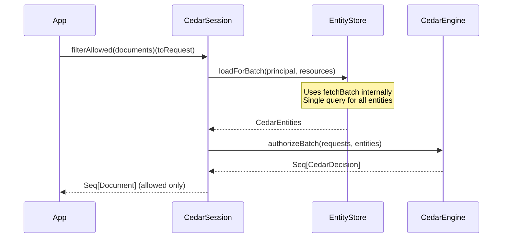

# Batch Authorization

Check multiple resources efficiently with batch operations.

Examples below assume `import myapp.cedar.MyApp.*` is in scope.

## Overview

`CedarSession[F]` provides batch methods for multi-resource authorization:

```scala
trait CedarSession[F[_]] {
  // Execute multiple requests, returning results for each
  def batchRun(requests: Seq[AuthCheck[?, ?, ?]]): F[Seq[Either[CedarAuthError, Unit]]]
  
  // Check multiple requests, returning boolean for each
  def batchIsAllowed(requests: Seq[AuthCheck[?, ?, ?]]): F[Seq[Boolean]]
  
  // Filter items to only those the principal can access
  def filterAllowed[A](items: Seq[A])(toRequest: A => AuthCheck[?, ?, ?]): F[Seq[A]]
}
```

## filterAllowed

Filter a collection to only permitted items:

```scala
import myapp.cedar.MyApp.*

// Setup: Create session for current user
given session: CedarSession[Future] = runtime.session(currentUser)

val documents: Seq[Document] = loadDocuments()

val allowed: Future[Seq[Document]] = session.filterAllowed(documents) { doc =>
  Document.Read.on(DocumentId(doc.id))
}
// Returns only documents the user can read
```

## batchIsAllowed

Get boolean results for each item:

```scala
given session: CedarSession[Future] = runtime.session(currentUser)

val documents: Seq[Document] = loadDocuments()
val checks = documents.map(doc => Document.Read.on(DocumentId(doc.id)))

val results: Future[Seq[Boolean]] = session.batchIsAllowed(checks)
// Seq(true, false, true, ...)
```

Useful when you need to show all items but indicate which are accessible.

## batchRun

Get detailed results including error information:

```scala
given session: CedarSession[Future] = runtime.session(currentUser)

val checks = documents.map(doc => Document.Read.on(DocumentId(doc.id)))

val results: Future[Seq[Either[CedarAuthError, Unit]]] = session.batchRun(checks)

results.map { outcomes =>
  outcomes.zipWithIndex.foreach { case (result, i) =>
    result match {
      case Right(()) => println(s"Document ${i}: allowed")
      case Left(err) => println(s"Document ${i}: denied - ${err.message}")
    }
  }
}
```

## Batch Flow



Batch operations:

1. Collect all resource references from the requests
2. Load all entities in a single batch (using `fetchBatch` if implemented)
3. Evaluate all authorization requests against the loaded entities
4. Return results

## Performance Impact

Without batch operations (N individual checks):

```
Document 1: load entities (5ms) + evaluate (1ms) = 6ms
Document 2: load entities (5ms) + evaluate (1ms) = 6ms
...
Document 100: load entities (5ms) + evaluate (1ms) = 6ms
Total: ~600ms
```

With batch operations:

```
Load all entities once (5ms) + evaluate all (10ms) = 15ms
Total: ~15ms (40x faster)
```

## Implementing fetchBatch

For batch operations to be efficient, implement `fetchBatch` in your `EntityFetcher`:

```scala
class DocumentFetcher(db: Database)(using ec: ExecutionContext)
    extends EntityFetcher[Future, Entities.Document, DocumentId] {
  
  def fetch(id: DocumentId): Future[Option[Entities.Document]] =
    db.findDocument(id.value).map(_.map(toCedar))
  
  // Single SQL query for all IDs
  override def fetchBatch(ids: Set[DocumentId])(using Applicative[Future]): Future[Map[DocumentId, Entities.Document]] =
    db.run(documents.filter(_.id.inSet(ids.map(_.value))).result).map { docs =>
      docs.map(d => DocumentId(d.id) -> toCedar(d)).toMap
    }
}
```

See [Entity Fetchers](../04-entities/01-fetchers.md) for details.

## Practical Examples

### List Page with Permissions

```scala
def listDocuments(folderId: FolderId)(using session: CedarSession[Future]): Future[Seq[DocumentWithPermissions]] = {
  for {
    docs <- documentService.listByFolder(folderId.value)

    // Check read permission for display
    readable <- session.batchIsAllowed(docs.map(d => Document.Read.on(DocumentId(d.id))))

    // Check edit permission for UI
    editable <- session.batchIsAllowed(docs.map(d => Document.Edit.on(DocumentId(d.id))))
  } yield {
    docs.zip(readable).zip(editable).map { case ((doc, canRead), canEdit) =>
      DocumentWithPermissions(doc, canRead = canRead, canEdit = canEdit)
    }
  }
}
```

### Bulk Operations

```scala
def deleteDocuments(docIds: Seq[String])(using session: CedarSession[Future]): Future[BulkDeleteResult] = {
  for {
    docs <- documentService.getMany(docIds)

    // Filter to only deletable documents
    deletable <- session.filterAllowed(docs)(d => Document.Delete.on(DocumentId(d.id)))

    // Delete allowed documents
    _ <- documentService.deleteMany(deletable.map(_.id))
  } yield {
    BulkDeleteResult(
      deleted = deletable.size,
      denied = docIds.size - deletable.size
    )
  }
}
```

