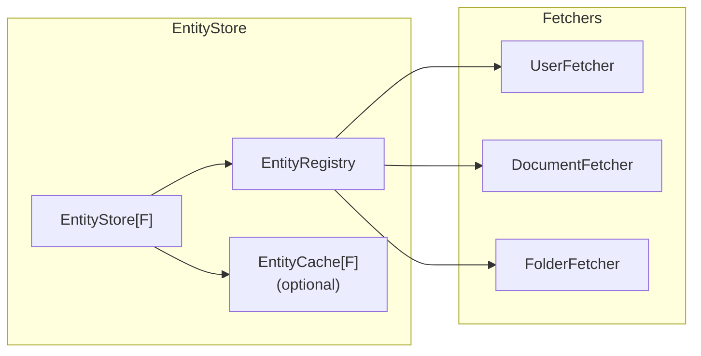

import Tabs from '@theme/Tabs';
import TabItem from '@theme/TabItem';

# Entity Store

`EntityStore[F]` manages entity loading for authorization requests.

## Overview



## Building an EntityStore

<Tabs groupId="scala-version">
<TabItem value="scala3" label="Scala 3" default>

```scala
import cedar4s.entities.EntityStore
import scala.concurrent.Future
import scala.concurrent.ExecutionContext.Implicits.global

// Import generated entity and ID types
import com.example.myapp.cedar.Entities
import com.example.myapp.cedar.EntityIds.{UserId, FolderId, DocumentId}

val store: EntityStore[Future] = EntityStore.builder[Future]()
  .register[Entities.User, UserId](new UserFetcher(db))
  .register[Entities.Folder, FolderId](new FolderFetcher(db))
  .register[Entities.Document, DocumentId](new DocumentFetcher(db))
  .build()
```

</TabItem>
<TabItem value="scala2" label="Scala 2">

```scala
import cedar4s.entities.EntityStore
import scala.concurrent.Future
import scala.concurrent.ExecutionContext
import scala.concurrent.ExecutionContext.Implicits.global

// Import generated entity and ID types
import com.example.myapp.cedar.Entities
import com.example.myapp.cedar.EntityIds.{UserId, FolderId, DocumentId}

val store: EntityStore[Future] = EntityStore.builder[Future]()
  .register[Entities.User, UserId](new UserFetcher(db))
  .register[Entities.Folder, FolderId](new FolderFetcher(db))
  .register[Entities.Document, DocumentId](new DocumentFetcher(db))
  .build()
```

</TabItem>
</Tabs>

Each `register` call associates an entity type with its fetcher, using typed IDs. The registration requires an implicit `CedarEntityType.Aux[A, Id]` which ensures type-safe matching between the entity's ID type and the fetcher's ID type. This is automatically available for generated entity classes.

## Type-Safe Registration

The `register` method uses `CedarEntityType.Aux[A, Id]` to ensure compile-time type safety:

```scala
def register[A, Id](fetcher: EntityFetcher[F, A, Id])(
  implicit ev: CedarEntityType.Aux[A, Id],
  bij: Bijection[String, Id]
): EntityStoreBuilder[F]
```

This means:
- The entity type `A` must have a `CedarEntityType` instance (automatically generated for Cedar entities)
- The fetcher's ID type `Id` must match the entity's ID type (enforced by `Aux[A, Id]`)
- A `Bijection[String, Id]` must be available to convert between String and ID types (automatically generated for newtype IDs)

The compiler will reject mismatched types:

```scala
// This won't compile - UserId doesn't match DocumentId
.register[Entities.Document, UserId](documentFetcher)  // ❌ Compile error

// This works - types match
.register[Entities.Document, DocumentId](documentFetcher)  // ✅
```

## Key Methods

```scala
trait EntityStore[F[_]] {
  // Load entities for a single authorization request
  def loadForRequest(principal: CedarPrincipal, resource: ResourceRef): F[CedarEntities]
  
  // Load entities for batch authorization (multiple resources)
  def loadForBatch(principal: CedarPrincipal, resources: Seq[ResourceRef]): F[CedarEntities]
  
  // Load a single entity
  def loadEntity(entityType: String, entityId: String): F[Option[CedarEntity]]
  
  // Load multiple entities
  def loadEntities(uids: Set[CedarEntityUid]): F[CedarEntities]
  
  // Load entity with parent chain (for .on(id) syntax)
  def loadEntityWithParents(entityType: String, entityId: String): F[Option[(CedarEntity, List[(String, String)])]]
}
```

## Usage with CedarSession

`EntityStore` is typically used with `CedarRuntime` and `CedarSession`:

```scala
import cedar4s.client.{CedarEngine, CedarRuntime}
import com.example.myapp.cedar.MyApp

// Principal resolver - returns principal entity
def resolvePrincipal(principal: Principal): Future[Option[MyApp.Entity.User]] = {
  principal match {
    case MyApp.Principal.User(userId) =>
      // Load user from database
      userRepo.find(userId.value).map { user =>
        Some(MyApp.Entity.User(
          id = userId,
          email = user.email,
          name = user.name
        ))
      }
    case _ => Future.successful(None)
  }
}

// Create runtime with explicit principal type
val runtime = CedarRuntime[Future, MyApp.Entity.User](
  engine,
  store,
  CedarRuntime.resolverFrom(resolvePrincipal)
)

def sessionFor(currentUser: User): CedarSession[Future] =
  runtime.session(MyApp.Principal.User(UserId(currentUser.id)))
```

## Adding Caching

Add a cache for better performance:

<Tabs groupId="scala-version">
<TabItem value="scala3" label="Scala 3" default>

```scala
import cedar4s.caffeine.{CaffeineEntityCache, CaffeineCacheConfig}

val cache = CaffeineEntityCache[Future](CaffeineCacheConfig.default)

val store = EntityStore.builder[Future]()
  .register[Entities.User, UserId](new UserFetcher(db))
  .register[Entities.Document, DocumentId](new DocumentFetcher(db))
  .withCache(cache)
  .build()
```

</TabItem>
<TabItem value="scala2" label="Scala 2">

```scala
import cedar4s.caffeine.{CaffeineEntityCache, CaffeineCacheConfig}

val cache = CaffeineEntityCache[Future](CaffeineCacheConfig.default)

val store = EntityStore.builder[Future]()
  .register[Entities.User, UserId](new UserFetcher(db))
  .register[Entities.Document, DocumentId](new DocumentFetcher(db))
  .withCache(cache)
  .build()
```

</TabItem>
</Tabs>

See [Caching](./03-caching.md) for configuration details.

## Accessing Cache Management

Use `.buildCaching()` to get a store with cache management methods:

```scala
val cachingStore = EntityStore.builder[Future]()
  .register[Entities.User, UserId](new UserFetcher(db))
  .withCache(cache)
  .buildCaching()  // Returns CachingEntityStoreGeneric

// Invalidation methods are available directly on the caching store
cachingStore.invalidate(CedarEntityUid("MyApp::User", "user-123"))
cachingStore.invalidateType("MyApp::User")
cachingStore.invalidateAll()

// Or access the underlying cache via getCache
cachingStore.getCache.invalidateWithCascade(uid, EntitySchema.childrenOf)
```

## Lifecycle

`EntityStore` is typically a singleton in your application:

```scala
// At application startup
val entityStore = EntityStore.builder[Future]()
  .register[Entities.User, UserId](new UserFetcher(db))
  .register[Entities.Folder, FolderId](new FolderFetcher(db))
  .register[Entities.Document, DocumentId](new DocumentFetcher(db))
  .withCache(CaffeineEntityCache[Future](CaffeineCacheConfig.default))
  .build()

// Per-request: create CedarSession with shared EntityStore
def createCedarSession(user: User): CedarSession[Future] =
  runtime.session(Principals.User(UserId(user.id)))
```

