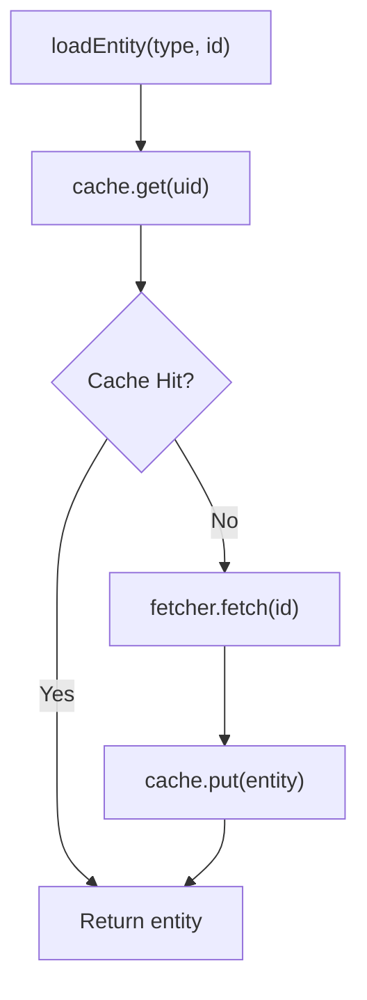

# Entity Caching

Cache entities to reduce database load and improve authorization latency.

## Setup

Add the Caffeine module:

```scala title="build.sbt"
libraryDependencies += "io.github.devnico" %% "cedar4s-caffeine" % "{{VERSION}}"
```

Configure caching:

```scala
import cedar4s.caffeine.{CaffeineEntityCache, CaffeineCacheConfig}

val cache = CaffeineEntityCache[Future](CaffeineCacheConfig.default)

val store = EntityStore.builder[Future]()
  .register[Entities.User, String](new UserFetcher(db))
  .register[Entities.Document, String](new DocumentFetcher(db))
  .withCache(cache)
  .build()
```

## Cache Flow



## Configuration Presets

| Preset | Max Size | TTL | Use Case |
|--------|----------|-----|----------|
| `default` | 10,000 | 5 min | General purpose |
| `highThroughput` | 100,000 | 1 min write, 30s access | High request volume |
| `shortLived` | 50,000 | 30 sec | Frequently changing data |
| `large` | 500,000 | 30 min | Stable data, large entity sets |
| `testing` | 100 | 1 sec | Unit tests |

```scala
// Use a preset
val cache = CaffeineEntityCache[Future](CaffeineCacheConfig.highThroughput)
```

## Custom Configuration

```scala
import scala.concurrent.duration.*

val config = CaffeineCacheConfig(
  maximumSize = 50_000,
  expireAfterWrite = Some(2.minutes),
  expireAfterAccess = Some(30.seconds),
  recordStats = true
)

val cache = CaffeineEntityCache[Future](config)
```

### Configuration Options

| Option | Description | Default |
|--------|-------------|---------|
| `maximumSize` | Maximum number of cached entities | 10,000 |
| `expireAfterWrite` | TTL from when entity was cached | 5 minutes |
| `expireAfterAccess` | TTL from last access | None |
| `recordStats` | Enable hit/miss statistics | false |

## TTL Guidelines by Entity Type

| Entity Type | Suggested TTL | Reasoning |
|-------------|---------------|-----------|
| Users | 5+ min | Changes infrequently |
| Roles/Permissions | 10+ min | Very stable |
| Documents | 1-5 min | Balance freshness vs performance |
| Sessions | 30s-1 min | Security consideration |
| Audit logs | No cache | Write-heavy, rarely read |

## Cache Invalidation

Use `.buildCaching()` to access invalidation methods:

```scala
val store = EntityStore.builder[Future]()
  .register[Entities.User, String](new UserFetcher(db))
  .withCache(cache)
  .buildCaching()

// Invalidate specific entity
store.invalidate(CedarEntityUid("MyApp::User", "user-123"))

// Invalidate all entities of a type
store.invalidateType("MyApp::User")

// Clear entire cache
store.invalidateAll()
```

You can also invalidate with typed IDs:

```scala
// Typed invalidation (uses CedarEntityType + Bijection)
store.invalidateEntity[Entities.User, UserId](userId)
store.invalidateTypeOf[Entities.User]
```

### When to Invalidate

Invalidate when entity data changes:

```scala
class UserService(store: CachingEntityStore[Future], db: Database) {
  
  def updateUser(userId: String, updates: UserUpdates): Future[User] = {
    for {
      user <- db.updateUser(userId, updates)
      _ <- store.invalidate(CedarEntityUid("MyApp::User", userId))
    } yield user
  }
  
  def deleteUser(userId: String): Future[Unit] = {
    for {
      _ <- db.deleteUser(userId)
      _ <- store.invalidate(CedarEntityUid("MyApp::User", userId))
    } yield ()
  }
}
```

### Cascade Invalidation

When entity relationships change, invalidate related entities. You must provide a `childrenOf` function that returns the set of child entity type names for a given parent entity type:

```scala
// Define the childrenOf function based on your schema
def childrenOf(entityType: String): Set[String] = entityType match {
  case "MyApp::Folder" => Set("MyApp::Document")  // Documents are children of Folders
  case "MyApp::Organization" => Set("MyApp::Workspace", "MyApp::User")  // Workspaces and Users are children of Organizations
  case _ => Set.empty
}

// Invalidate folder and all cached documents in it
store.getCache.invalidateWithCascade(
  CedarEntityUid("MyApp::Folder", folderId),
  childrenOf
)
```

Or with typed IDs:

```scala
store.getCache.invalidateEntityWithCascade[Entities.Folder, FolderId](
  folderId,
  childrenOf
)
```

The `childrenOf` function determines which entity types should be invalidated when a parent changes. For example, if a folder is deleted, you may want to invalidate all documents in that folder.

## Cache Statistics

Monitor cache performance:

```scala
store.cacheStats.map { stats =>
  stats.foreach { s =>
    println(s"Hit rate: ${s.hitRate}")
    println(s"Size: ${s.size}")
    println(s"Evictions: ${s.evictionCount}")
  }
}
```

### Key Metrics

| Metric | Target | Action if Low |
|--------|--------|---------------|
| Hit Rate | above 80% | Increase TTL or cache size |
| Eviction Rate | under 10% | Increase maximum size |

## Custom Cache Backends

Implement `EntityCache[F]` for custom backends (Redis, Memcached, etc.):

```scala
trait EntityCache[F[_]] {
  def get(uid: CedarEntityUid): F[Option[CedarEntity]]
  def getMany(uids: Set[CedarEntityUid]): F[Map[CedarEntityUid, CedarEntity]]
  def put(entity: CedarEntity): F[Unit]
  def putMany(entities: Iterable[CedarEntity]): F[Unit]
  def invalidate(uid: CedarEntityUid): F[Unit]
  def invalidateEntity[A, Id](id: Id)(implicit ev: CedarEntityType.Aux[A, Id], bij: Bijection[String, Id]): F[Unit]
  def invalidateType(entityType: String): F[Unit]
  def invalidateTypeOf[A](implicit ev: CedarEntityType[A]): F[Unit]
  def invalidateWithCascade(uid: CedarEntityUid, childrenOf: String => Set[String]): F[Unit]
  def invalidateEntityWithCascade[A, Id](id: Id, childrenOf: String => Set[String])(
    implicit ev: CedarEntityType.Aux[A, Id],
    bij: Bijection[String, Id]
  ): F[Unit]
  def invalidateAll(): F[Unit]
  def stats: F[Option[CacheStats]]
}
```

### No-Op Cache

For testing or when caching should be disabled:

```scala
val noCache = EntityCache.none[Future]
```

