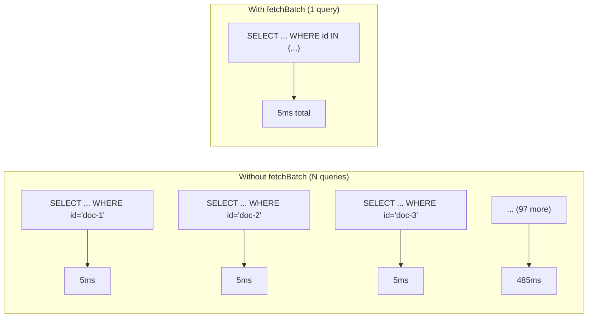
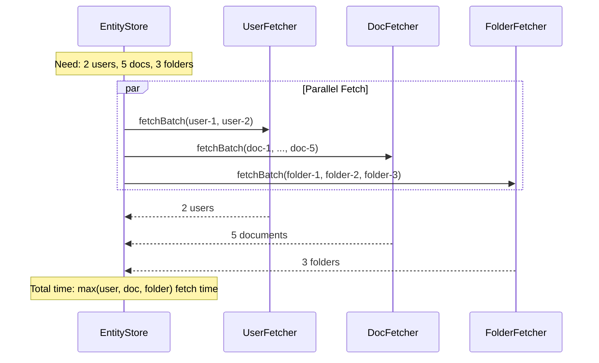

# Batch Entity Loading

Optimize multi-entity loading with `fetchBatch` for high-throughput authorization.

## The Problem

Without batch loading, checking 100 documents requires 100 database queries:



For 100 documents: **~500ms** without batch vs **~5ms** with batch (100x faster).

## Implementing fetchBatch

Override `fetchBatch` in your `EntityFetcher`:

```scala
class DocumentFetcher(db: Database)(using ec: ExecutionContext)
    extends EntityFetcher[Future, Entities.Document, String] {
  
  def fetch(id: String): Future[Option[Entities.Document]] =
    db.findDocument(id).map(_.map(toCedar))
  
  override def fetchBatch(ids: Set[String])(using Applicative[Future]): Future[Map[String, Entities.Document]] =
    db.run(documents.filter(_.id.inSet(ids)).result).map { docs =>
      docs.map(d => d.id -> toCedar(d)).toMap
    }
  
  private def toCedar(doc: DomainDocument): Entities.Document = ...
}
```

### Return Type

`fetchBatch` returns `F[Map[Id, A]]`:

- Keys are the entity IDs
- Values are the loaded entities
- Missing IDs are simply not included in the map

```scala
// Request IDs: Set("doc-1", "doc-2", "doc-3")
// If doc-2 doesn't exist:
// Result: Map("doc-1" -> Document(...), "doc-3" -> Document(...))
```

## Database-Specific Examples

### Slick (PostgreSQL/MySQL)

```scala
override def fetchBatch(ids: Set[String])(using Applicative[Future]) =
  db.run(documents.filter(_.id.inSet(ids)).result).map { docs =>
    docs.map(d => d.id -> toCedar(d)).toMap
  }
```

### Doobie (PostgreSQL)

```scala
import doobie.*
import doobie.implicits.*
import doobie.postgres.implicits.*

override def fetchBatch(ids: Set[String])(using Applicative[Future]) = {
  val query = 
    fr"SELECT id, folder_id, name, owner FROM documents WHERE" ++ 
    Fragments.in(fr"id", ids.toList.toNel.get)
  
  query.query[DomainDocument]
    .to[List]
    .transact(xa)
    .map(docs => docs.map(d => d.id -> toCedar(d)).toMap)
    .unsafeToFuture()
}
```

### Skunk (PostgreSQL)

```scala
import skunk.*
import skunk.implicits.*

override def fetchBatch(ids: Set[String])(using Applicative[Future]) = {
  val idList = ids.toList
  val query = sql"""
    SELECT id, folder_id, name, owner 
    FROM documents 
    WHERE id = ANY($text4)
  """.query(document)
  
  session.prepare(query).flatMap(_.stream(idList, 64).compile.toList)
    .map(docs => docs.map(d => d.id -> toCedar(d)).toMap)
    .unsafeToFuture()
}
```

## Factory Method

Use the factory for simple cases:

```scala
val fetcher = EntityFetcher.withBatch[Future, Entities.Document](
  f = id => db.findDocument(id).map(_.map(toCedar)),
  batch = ids => db.findDocuments(ids).map(_.map(d => d.id -> toCedar(d)).toMap)
)
```

## When fetchBatch is Called

`EntityStore` calls `fetchBatch` when:

1. **Batch authorization** - `runner.filterAllowed(items)` or `runner.batchIsAllowed(checks)`
2. **Loading entities for request** - When multiple entities of the same type are needed
3. **Deferred resolution** - When loading parent chains for multiple resources

If `fetchBatch` is not overridden, the default implementation calls `fetch` for each ID individually.

## Chunking Large Batches

For very large batches, consider chunking:

```scala
override def fetchBatch(ids: Set[String])(using Applicative[Future]) = {
  val chunks = ids.grouped(1000).toList  // Max 1000 per query
  
  Future.sequence(chunks.map { chunk =>
    db.run(documents.filter(_.id.inSet(chunk)).result)
  }).map { results =>
    results.flatten.map(d => d.id -> toCedar(d)).toMap
  }
}
```

This avoids database query size limits while still being much faster than individual queries.

## Parallel Loading Across Types

`EntityStore` loads different entity types in parallel:



## Performance Tips

1. **Always implement fetchBatch** - Even with caching, cold starts benefit from batch loading

2. **Add database indexes** - Ensure your `id` columns are indexed for IN queries

3. **Monitor query performance** - Large IN clauses can be slow without proper indexes

4. **Consider query limits** - Some databases limit IN clause size (e.g., Oracle: 1000)

5. **Use appropriate batch sizes** - Balance between fewer queries and query complexity

