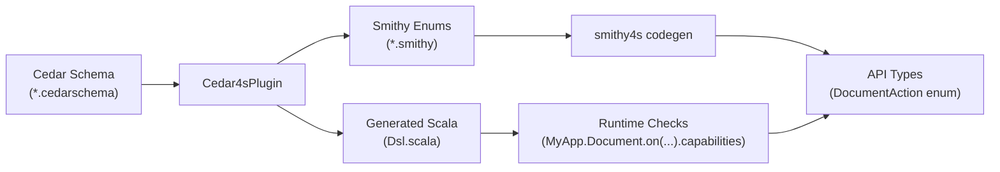

# Smithy Action Enums

cedar4s can generate Smithy enum files from your Cedar schema, providing type-safe
action enums for use in smithy4s API definitions.

## Overview

When building APIs with [smithy4s](https://disneystreaming.github.io/smithy4s/), you
often need to return capability information to frontends (e.g., "which actions can this
user perform on this resource?"). cedar4s generates Smithy enums from your Cedar
actions, enabling type-safe capability responses.

This feature works alongside the
[resource capabilities DSL](../06-integrations/02-frontend-capabilities.md) which
computes allowed actions at runtime.



## Generated Output

For each domain with actions in your Cedar schema, cedar4s generates a Smithy file containing:

- **Action enum**: All actions for that domain
- **Allowed actions list**: A list type for capability responses
- **Capabilities mixin**: A mixin structure to add `allowedActions` to your types

### Example

Given this Cedar schema:

```cedar
namespace DocShare;

entity Document {}

action "Document::read" appliesTo {
    principal: [User],
    resource: Document
};

action "Document::update" appliesTo {
    principal: [User],
    resource: Document
};

action "Document::delete" appliesTo {
    principal: [User],
    resource: Document
};
```

cedar4s generates:

```smithy
$version: "2.0"

namespace com.example.api.authz

/// Actions available for the Document domain.
enum DocumentAction {
    /// Delete document
    DELETE = "delete"

    /// Read document
    READ = "read"

    /// Update document
    UPDATE = "update"
}

/// List of allowed Document actions for capability responses
list DocumentAllowedActions {
    member: DocumentAction
}

/// Mixin to add Document capabilities to a structure.
@mixin
structure DocumentCapabilitiesMixin {
    /// Actions the current user is allowed to perform on this Document
    @required
    allowedActions: DocumentAllowedActions
}
```

## Setup

Enable Smithy generation in your build:

```scala title="build.sbt"
enablePlugins(Cedar4sPlugin)

// Required: Smithy namespace for generated enums
cedarSmithyNamespace := Some("com.example.api.authz")

// Required: Output directory for .smithy files
cedarSmithyOutputDir := Some(baseDirectory.value / "smithy-specs" / "authz")
```

Both settings must be defined to enable Smithy generation. If only one is set, generation is disabled with a warning.

## Using the Capabilities Mixin

The generated mixin is the simplest way to add capabilities to your API types. Apply it with the `with` clause:

```smithy title="api/document.smithy"
$version: "2.0"

namespace com.example.api

use com.example.api.authz#DocumentCapabilitiesMixin

structure Document with [DocumentCapabilitiesMixin] {
    @required
    id: String
    @required
    name: String
}

operation GetDocument {
    input := {
        @required
        documentId: String
    }
    output := Document
}
```

The mixin adds `allowedActions: DocumentAllowedActions` to your structure
automatically.

After smithy4s codegen, implement the endpoint using
[resource capabilities](../06-integrations/02-frontend-capabilities.md):

```scala
import myapp.cedar.Actions.Document.DocumentAction as CedarAction
import myapp.cedar.MyApp
import myapp.api.{Document => ApiDocument, DocumentAction => ApiAction}

def getDocument(documentId: String)(
    using session: CedarSession[IO]
): IO[ApiDocument] = {
  for {
    doc <- documentService.get(documentId)
    caps <- MyApp.Document.on(doc.folderId, documentId).capabilities
    apiActions = caps.allowed.toList.map(a => ApiAction.fromString(a.name.toUpperCase))
  } yield ApiDocument(
    id = doc.id,
    name = doc.name,
    allowedActions = apiActions
  )
}
```

## Action Name Conversion

Cedar action names are converted to Smithy enum cases:

| Cedar Action | Smithy Enum |
|-------------|-------------|
| `read` | `READ` |
| `read-file` | `READ_FILE` |
| `list_all` | `LIST_ALL` |
| `create.draft` | `CREATE_DRAFT` |

The conversion uppercases the name and replaces `-` and `.` with `_`.

## Configuration Reference

| Setting | Type | Description |
|---------|------|-------------|
| `cedarSmithyNamespace` | `Option[String]` | Smithy namespace for generated files |
| `cedarSmithyOutputDir` | `Option[File]` | Output directory for .smithy files |

## Multi-Domain Example

With multiple entity types:

```cedar
namespace DocShare;

entity Folder {}
entity Document {}

action "Folder::read" appliesTo { principal: [User], resource: Folder };
action "Folder::create" appliesTo { principal: [User], resource: Folder };

action "Document::read" appliesTo { principal: [User], resource: Document };
action "Document::update" appliesTo { principal: [User], resource: Document };
```

Generates two Smithy files:

- `FolderAction.smithy` with `FolderAction` enum, `FolderAllowedActions` list, and `FolderCapabilitiesMixin`
- `DocumentAction.smithy` with `DocumentAction` enum, `DocumentAllowedActions` list, and `DocumentCapabilitiesMixin`

Use each mixin independently:

```smithy
use com.example.api.authz#FolderCapabilitiesMixin
use com.example.api.authz#DocumentCapabilitiesMixin

structure Folder with [FolderCapabilitiesMixin] {
    @required
    id: String
    @required
    name: String
}

structure Document with [DocumentCapabilitiesMixin] {
    @required
    id: String
    @required
    name: String
    @required
    folderId: String
}
```

