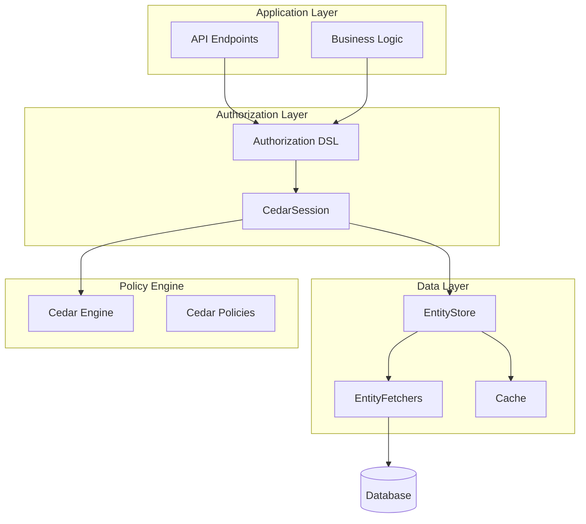

# Design Philosophy

cedar4s is designed around several core principles that guide its architecture and API design.

## Inspiration from smithy4s

cedar4s is heavily inspired by [smithy4s](https://disneystreaming.github.io/smithy4s/), which generates type-safe Scala code from Smithy API definitions. We apply the same approach to Cedar authorization schemas:

| smithy4s | cedar4s |
|----------|---------|
| Smithy API specs | Cedar schemas |
| Generated service traits | Generated action DSL |
| Type-safe request/response | Type-safe auth requests |
| Protocol-agnostic | Effect-polymorphic |

The key insight: authorization models, like API definitions, benefit from code
generation that provides compile-time guarantees.

## Type Safety at Compile Time

Authorization errors should be caught at compile time, not runtime:

```scala
import myapp.cedar.MyApp.*

// Compile error: DocumentId expected, got FolderId
Document.Read(folderId, folderId)

// Compile error: User cannot perform Admin action (no CanPerform evidence)
AdminAction.DeleteAll(userId).asPrincipal(Principals.User(userId))

// Compile error: Missing required EntityFetcher registration
val store = EntityStore.builder[Future]()
  // .register[Entities.Document, String](docFetcher)  // Forgot this!
  .build()
// Error when Document.Read.on(id) is called
```

## Separation of Concerns

cedar4s separates authorization into distinct layers:



Each layer has a single responsibility:

- **DSL**: Express what permission is needed
- **CedarSession**: Orchestrate the authorization check
- **EntityStore**: Load entity data
- **Cedar Engine**: Evaluate policies

## Effect Polymorphism

cedar4s doesn't force a specific effect type. All APIs are generic over `F[_]`:

```scala
trait CedarSession[F[_]]
trait EntityStore[F[_]]
trait EntityFetcher[F[_], E, Id]
```

This means:

- Use `Future` for simple applications
- Use cats-effect `IO` for functional applications
- Use ZIO for ZIO-based applications
- Use custom effects for specialized needs

We provide minimal type classes (`Sync`, `Concurrent`, `FlatMap`) to avoid forcing external dependencies.

## Composability

Authorization checks compose naturally:

```scala
import myapp.cedar.MyApp.*

// Single check
val single = Document.Read(folderId, docId)

// Combine with AND
val both = Folder.Read(folderId) & Document.Read(folderId, docId)

// Combine with OR
val either = Document.Edit(folderId, docId) | Document.Admin(folderId, docId)

// Complex composition
val complex = (Folder.Read(folderId) & Document.Read(folderId, docId)) | Admin.Override(userId)
```

Composition is:

- **Type-safe**: Compiler tracks what's being combined
- **Lazy**: Nothing executes until `.run`, `.require`, or `.isAllowed`
- **Optimizable**: Batch operations can optimize composed checks

## Minimal Dependencies

cedar4s core depends only on:

- Scala standard library
- cedar-java (Cedar policy engine)

Optional modules add specific capabilities:

- `cedar4s-caffeine`: Caffeine-based caching

For other effect libraries (cats-effect, ZIO), you provide bridge instances that
adapt cedar4s type classes to your effect type. See
[Effect Types](../06-integrations/01-effect-types.md) for examples.

## Schema as Source of Truth

The Cedar schema is the single source of truth for your authorization model:

```cedar
namespace MyApp {
  entity User {}
  entity Folder {}
  entity Document in [Folder] {
    owner: User,
    locked: Bool
  }
  
  action "Document::Read" appliesTo {
    principal: [User],
    resource: Document
  };
}
```

From this schema, cedar4s generates:

- Entity types (`Entities.Document`)
- Action types (`Actions.Document.Read`)
- DSL methods (`Document.Read(folderId, docId)`)
- Type evidence (`CanPerform[User, Document.Read]`)

Changes to the schema propagate to all generated code, ensuring consistency.

## Explicit Over Implicit

cedar4s favors explicit configuration over magic:

```scala
// Explicit registration of fetchers
val store = EntityStore.builder[Future]()
  .register[Entities.User, String](userFetcher)
  .register[Entities.Document, String](documentFetcher)
  .build()

// Explicit session creation at boundary
val runtime = CedarRuntime[Future](engine, store, CedarRuntime.resolverFrom(buildPrincipal))
val session = runtime.session(Principals.User(currentUserId))

// Explicit cache configuration
val cache = CaffeineEntityCache[Future](CaffeineCacheConfig(
  maximumSize = 10_000,
  expireAfterWrite = Some(5.minutes)
))
```

