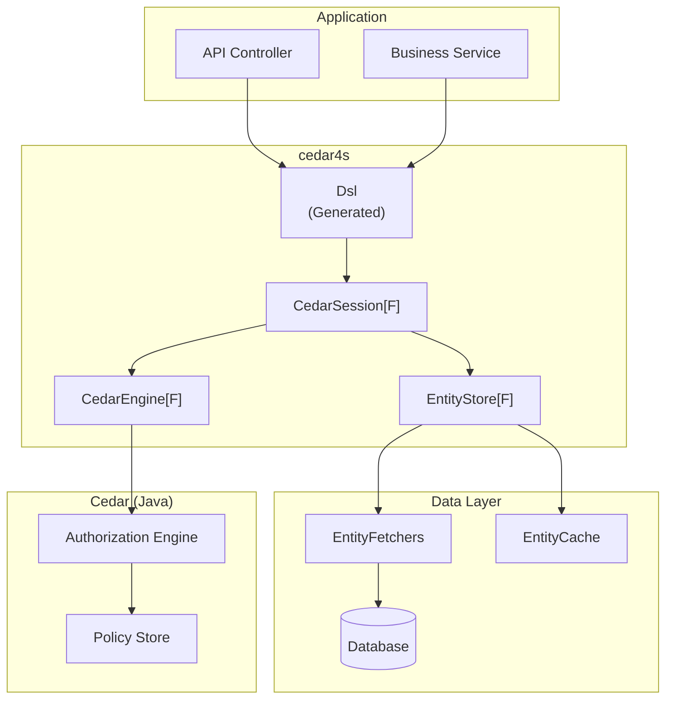
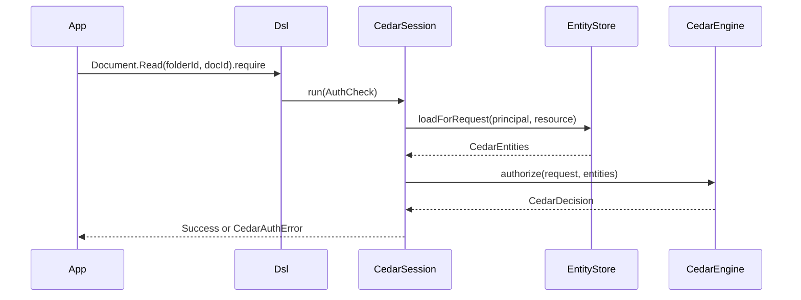
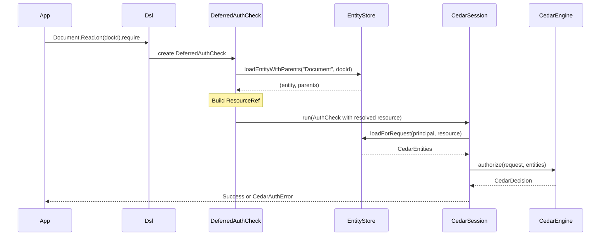
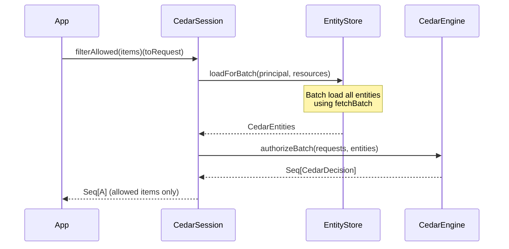

# System Architecture

Overview of cedar4s components and how they interact.

## High-Level Architecture



## Core Components

### CedarEngine[F]

Wraps the Cedar-Java authorization engine:

```scala
trait CedarEngine[F[_]] {
  def authorize(request: CedarRequest, entities: CedarEntities): F[CedarDecision]
  def authorizeBatch(requests: Seq[CedarRequest], entities: CedarEntities): F[Seq[CedarDecision]]
}
```

Responsibilities:

- Load and manage Cedar policies
- Execute authorization requests against policies
- Return allow/deny decisions with diagnostics

### CedarSession[F]

Orchestrates authorization checks:

```scala
trait CedarSession[F[_]] {
  def run(request: AuthCheck[?, ?, ?]): F[Either[CedarAuthError, Unit]]
  def require(request: AuthCheck[?, ?, ?]): F[Unit]
  def isAllowed(request: AuthCheck[?, ?, ?]): F[Boolean]
  def batchIsAllowed(requests: Seq[AuthCheck[?, ?, ?]]): F[Seq[Boolean]]
  def filterAllowed[A](items: Seq[A])(toRequest: A => AuthCheck[?, ?, ?]): F[Seq[A]]
}
```

Responsibilities:

- Convert `AuthCheck` to Cedar request format
- Load required entities via `EntityStore`
- Execute authorization via `CedarEngine`
- Handle errors and return results

### EntityStore[F]

Manages entity loading:

```scala
trait EntityStore[F[_]] {
  def loadForRequest(principal: CedarPrincipal, resource: ResourceRef): F[CedarEntities]
  def loadForBatch(principal: CedarPrincipal, resources: Seq[ResourceRef]): F[CedarEntities]
  def loadEntity(entityType: String, entityId: String): F[Option[CedarEntity]]
  def loadEntityWithParents(entityType: String, entityId: String): F[Option[(CedarEntity, List[(String, String)])]]
}
```

Responsibilities:

- Route entity requests to appropriate fetchers
- Manage entity caching
- Support batch loading for performance

### EntityFetcher[F, E, Id]

Loads entities from data sources:

```scala
trait EntityFetcher[F[_], E <: CedarEntity, Id] {
  def fetch(id: Id): F[Option[E]]
  def fetchBatch(ids: Set[Id])(using Applicative[F]): F[Map[Id, E]]
}
```

Responsibilities:

- Load domain entities from database/API
- Convert to Cedar entity format
- Support efficient batch loading

## Request Flow

### Simple Authorization



### Deferred Authorization



### Batch Authorization



## Module Structure

```
cedar4s/
├── modules/
│   ├── core/           # Core types and interfaces
│   │   ├── auth/       # CedarSession, AuthCheck
│   │   ├── entities/   # EntityStore, EntityFetcher, EntityCache
│   │   ├── engine/     # CedarEngine wrapper
│   │   └── capability/ # Effect type classes (Sync, Concurrent)
│   │
│   ├── types/          # Shared types (CedarEntity, CedarValue)
│   │
│   ├── codegen/        # Code generation from Cedar schemas
│   │
│   ├── caffeine/       # Caffeine cache implementation
│   │
│   ├── sbt-plugin/     # sbt plugin for code generation
│   │
│   └── bench/          # JMH benchmarks
│
└── website/            # Documentation (Docusaurus)
```

## Extension Points

### Custom EntityFetcher

Load entities from any data source:

```scala
class ApiDocumentFetcher(client: HttpClient)
    extends EntityFetcher[Future, Entities.Document, String] {
  
  def fetch(id: String): Future[Option[Entities.Document]] =
    client.get(s"/documents/$id").map(...)
}
```

### Custom EntityCache

Implement distributed caching:

```scala
class RedisEntityCache(redis: RedisClient) extends EntityCache[Future] {
  def get(uid: CedarEntityUid): Future[Option[CedarEntity]] = ...
  def put(entity: CedarEntity): Future[Unit] = ...
  // ...
}
```

### Custom CedarSession

Add cross-cutting concerns:

```scala
class AuditingCedarSession(underlying: CedarSession[Future], auditLog: AuditLog)
    extends CedarSession[Future] {
  
  def run(request: AuthCheck[?, ?, ?]): Future[Either[CedarAuthError, Unit]] = {
    underlying.run(request).map { result =>
      auditLog.record(request, result)
      result
    }
  }
}
```

